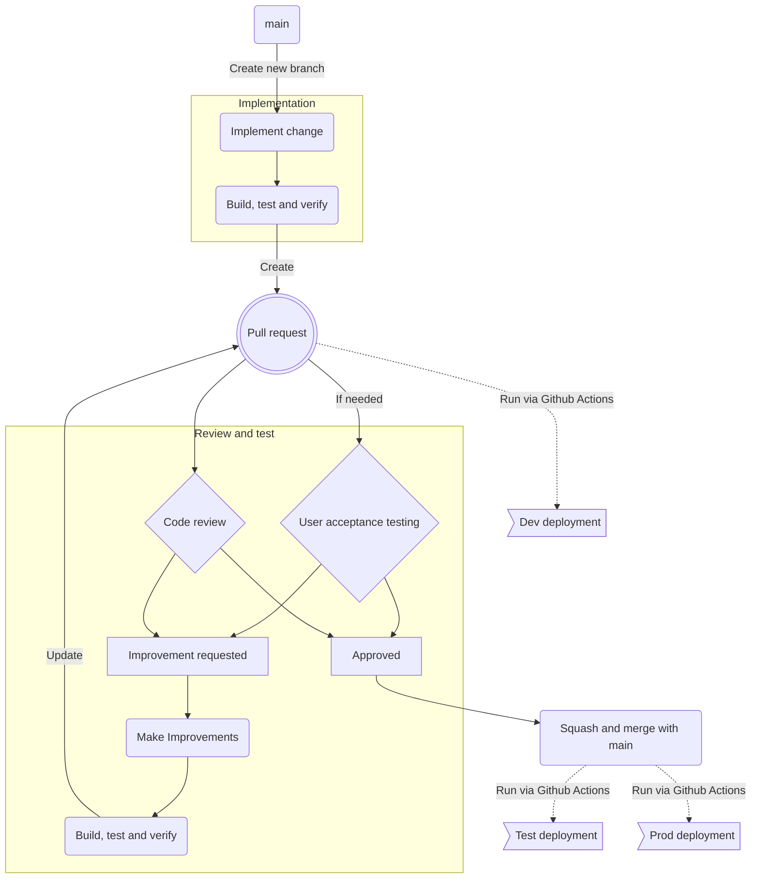

# Contributing

This repo uses [Trunk based development](https://trunkbaseddevelopment.com/) along with [Conventional commits](https://www.conventionalcommits.org/en/v1.0.0/). When making contributions follow this checklist:

- Ensure you have created an issue in Github Issues
- Create a new feature branch from the `main` branch
- Implement
- Perform a self-review of your code and ensure all CI is run before submitting the PR for approval.

## How we work

The following chart describes the development workflow for contributing changes to the repository.

